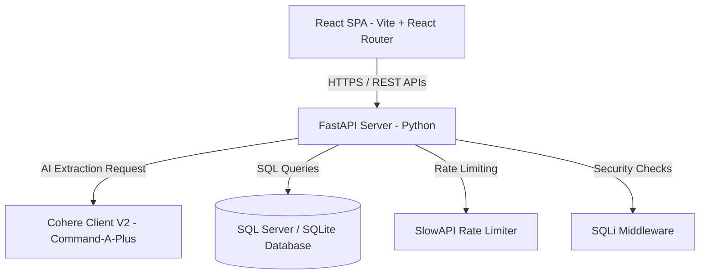

# Product Requirement Document (PRD) - RT International Call Center CRM & AI Utility Extraction Portal

## 1. Document Control
- **Document Title:** Product Requirement Document (PRD) - RT International Portal
- **Document Version:** 1.0.0
- **Authors:** Senior Technical Architect
- **Status:** Approved
- **Target Release:** Q3 2026
- **Last Updated:** May 24, 2026

---

## 2. Executive Summary

### 2.1 Overview
RT International is a specialized, multi-role Call Center Portal and CRM system tailored for the UK commercial utility brokerage industry. The platform empowers frontline agents to manage commercial clients, document current utility metrics (electricity and gas), leverage advanced AI to parse unstructured broker call notes, schedule callbacks, initiate account transfers, and submit finalized sales with structured banking and contract information.

### 2.2 Core Value Proposition
- **Minimizing Manual Entry Errors:** By utilizing an AI Extraction Tool (powered by Cohere), unstructured call summaries are automatically parsed into highly structured meter and rate models.
- **Structured Lead Lifecycle:** Leads progress clearly from raw Customers -> Scheduled Callbacks -> Active Transfers -> Submitted Sales.
- **Enhanced Accountability:** Strict Role-Based Access Control (RBAC) separates Agents, Managers, and Admins. Managers oversee agent pipelines and dashboards, while Admins audit the entire system's activity logs.
- **Security Compliance:** Incorporates SQL Injection protection middleware, robust password hashing (bcrypt), JSON Web Token (JWT) session security, and rate-limiting.

---

## 3. Problem Statement & Market Opportunity
UK utility brokers communicate with hundreds of commercial clients daily. The current workflows suffer from several points of failure:
1. **Unstructured Data Loss:** Critical rates, supply numbers (MPAN/MPRN), serial numbers, and contract end dates are frequently buried in unstructured text notes, leading to transcription errors and loss of data integrity.
2. **Disconnected Pipeline:** Call center agents struggle to transition leads seamlessly from the initial callback to the transfer phase and final sale phase without losing key rate data.
3. **Lack of Manager Visibility:** Without localized management dashboards, managers cannot view agent conversion rates, track schedules, or re-assign callbacks efficiently.
4. **Compliance & Banking Risks:** Submitting commercial utility sales requires collecting sensitive banking info (Sort Code, Account Number, payment method, etc.) which must be validated and logged securely.

---

## 4. User Personas & Roles
RT International supports three core user roles:

| Role | Target User | Key Responsibilities | Dashboard Views |
| :--- | :--- | :--- | :--- |
| **Agent** | Frontline tele-broker / call agent | Add customer records, parse call notes using AI, schedule callbacks, create transfer offers, submit final sale applications with banking details. | Personal Dashboard, Customer Lists, My Callbacks, My Transfers, My Sales. |
| **Manager** | Team Leader / Call Center Manager | Oversee team performance, track agent metrics, create/edit team callbacks, transfers, and sales, view team activity logs and real-time sales/transfer notifications. | Team Dashboard, Agent Performance Analytics, Team Callbacks/Transfers/Sales management, Activity Notifications. |
| **Admin** | System Administrator / Business Owner | Manage managers and agents, configure system parameters, audit high-level analytics, view platform-wide security logs (`activity_logs`). | Admin Dashboard, Manager/Agent User Management, Platform-wide Analytics, Global System Activity Audit Log. |

---

## 5. System Architecture & Tech Stack

### 5.1 Frontend Architecture
- **Framework:** React.js (Vite compiler)
- **Routing:** React Router DOM (v6) with path-based layout nesting (Public, Protected, Role-based route configurations)
- **State Management:** Zustand (`authStore`) managing JWT session tokens and user state
- **CSS System:** Tailored modern styles with custom dark mode themes and premium design tokens (`index.css`)
- **Key Pages:**
  - `Login` & `Register`
  - `Dashboard` (Agent, Team/Manager, Admin)
  - `AddCallback` / `AddTransfer` / `SaleApplication` (multi-step data collection forms)

### 5.2 Backend Architecture
- **Framework:** FastAPI (Python 3.10+)
- **WSGI/ASGI Server:** Uvicorn (standard)
- **Database Engine:** Microsoft SQL Server (production) / SQLite (development & local testing)
- **ORM:** SQLAlchemy (declarative models, relationships, cascades)
- **Database Drivers:** PyODBC (SQL Server connectivity)
- **Security & Session Management:** JWT (PyJWT), bcrypt (password hashing), Custom SQL Injection Middleware
- **APIs:** Structured routers (`auth.py`, `customers.py`, `callbacks.py`, `transfers.py`, `sales.py`, `manager.py`, `admin.py`, `ai_router.py`, `profile.py`)

---

## 6. Functional Requirements

### 6.1 Authentication & User Management (RBAC)
- **FR-1.1:** Users must log in via email and password to receive a JWT access token.
- **FR-1.2:** The system must enforce strict role-based access control. Route endpoints in the API (e.g. `/api/manager/*` or `/api/admin/*`) must validate user role claims using FastAPI dependencies (`require_manager`, `require_admin`).
- **FR-1.3:** Admins must be able to create, read, update, and disable Manager and Agent accounts.
- **FR-1.4:** Managers are assigned a specific sub-group of agents. Managers can only view and edit records belonging to agents within their managed team.

### 6.2 Customer & Utility Meter Management
- **FR-2.1:** Agents can create a Customer profile consisting of business name, owner name, business phone, owner phone, email, site address, postcode, and utility type (`electricity` or `gas`).
- **FR-2.2:** Each Customer can have multiple associated **Electricity Meters** containing:
  - Supply Number (MPAN Core)
  - Meter Serial Number (MSN)
  - Account Number
  - Current Supplier
  - Day / Night / Evening Unit Rates (in p/kWh)
  - Standing Charge (in p/day)
  - Monthly Bill (£) and Contract End Date (CED)
- **FR-2.3:** Each Customer can have multiple associated **Gas Meters** containing:
  - Supply Number (MPRN Core)
  - Meter Serial Number (MSN)
  - Account Number
  - Current Supplier
  - Unit Rate (in p/kWh)
  - Standing Charge (in p/day)
  - Monthly Bill (£) and Contract End Date (CED)

### 6.3 AI Data Extraction Module
- **FR-3.1:** The portal must provide an AI parsing interface. Agents paste unstructured call notes into a text area, and the system sends it to `/api/ai/extract`.
- **FR-3.2:** The API communicates with the Cohere V2 endpoint using the `command-a-plus-05-2026` model to extract a highly structured JSON mapping of utility parameters.
- **FR-3.3:** Extraction rules must adhere to UK energy broker conventions (e.g., "UR" = dayUnitRate, "SC" = standingRate, "CED" = contractEndDate, "BG" = British Gas, "BG Lite" = British Gas Lite).
- **FR-3.4:** The AI must separate current meter rates from *offered rates* (commission vs. non-commission).
- **FR-3.5:** **Regex Fallback Engine:** In the event that Cohere API is offline or rate-limited, the system must execute local pattern-matching extraction to retrieve basic fields (postcode, email, phones, business name, and MPAN/MPRN) without crashing the application.

### 6.4 Callback Scheduling & Pricing Workflow
- **FR-4.1:** Agents can schedule callbacks for a specific date/time.
- **FR-4.2:** Callbacks can store multiple pricing offers for electricity and gas:
  - Contract length (12, 24, 36, 48, 60 months)
  - Offered supplier
  - Commission rates vs. Non-commission rates
  - Broker service charge (in p/kWh)
- **FR-4.3:** Callback statuses include `pending` and `done`. Transitioning a callback status updates the lifecycle state.

### 6.5 Transfer & Sales Execution (Banking & Submission)
- **FR-5.1:** Transitioning a lead to a **Transfer** allows agents to log official contract parameters (current and proposed suppliers, utility type, and account details).
- **FR-5.2:** Transitioning a transfer to a **Sale Application** requires compiling the Customer's banking information:
  - Bank Name
  - Bank Account Title
  - Account Type
  - Sort Code (6 digits)
  - Bank Account Number (8 digits)
  - Payment Method (e.g., Direct Debit, Cash/Cheque)
  - Bill Frequency (e.g., Monthly, Quarterly)
- **FR-5.3:** Sales track **Change of Tenancy (COT)** status (`submitted`, `chasing`, `done`) and COT dates, plus agent commission amounts.

### 6.6 Reporting, Analytics & Notifications
- **FR-6.1:** **Manager Team Dashboard:** Displays total team callbacks, active transfers, total sales, and team-wide conversion rates. Includes a leaderboard ranking agents by their conversion percentages.
- **FR-6.2:** **Real-time Notifications:** Displays a live feed of agent actions (e.g., "Usman Agent created a transfer", "Emily Agent closed a sale") for the Manager to monitor call-floor activity.
- **FR-6.3:** **Admin Analytics:** Visualizes platform analytics and displays a chronological audit log of all system actions logged in `activity_logs`.

---

## 7. Data Models (Database Schema)
The system runs on SQL Server / SQLite. Key relational schemas include:

1. **`users`**: Platform accounts (ID, Name, Email, Password Hash, Role, Manager ID, Is Active, Commission Rate).
2. **`customers`**: Commercial lead profiles (Business Name, Address, Phone, Email, Postcode, Utility Type).
3. **`electricity_meters` & `gas_meters`**: Existing meter properties and historical unit rates.
4. **`call_backs`**: Scheduled appointments, including detailed tables for electricity/gas commission-based and non-commission-based offered prices.
5. **`transfers`**: Records tracing current account numbers, MPAN, MPRN, offered rates, and transition timestamps.
6. **`sales`**: Closed business contract data, containing validated banking coordinates (Sort Code, Account Number), payment frequencies, COT logs, and commissions.
7. **`activity_logs`**: Chronological log recording IP address, actor ID, action type, description, and timestamp.
8. **`notifications`**: Targeted alerts for managers and admins concerning pipeline progress.

---

## 8. Non-Functional Requirements & Security
- **NFR-8.1 (Security):** All passwords must be stored using cryptographically secure bcrypt hashes. Plaintext passwords must never hit the database.
- **NFR-8.2 (Data Validation):** SQL injection protection middleware must sanitize inputs, preventing malicious queries.
- **NFR-8.3 (Performance):** The system must utilize index columns on high-frequency query fields: `customer_id`, `employee_id`, and `scheduled_datetime`.
- **NFR-8.4 (Rate Limiting):** API limits are set using SlowAPI to prevent denial of service (DoS) attacks on critical paths (e.g., 60 requests/minute per IP address).
- **NFR-8.5 (Compatibility):** Frontend must support standard desktop browsers (Chrome, Edge, Safari, Firefox) for call center operators.

---

## 9. Future Roadmap & Enhancements
- **Phase 2.1 (VOIP Dialer Integration):** Direct integration with softphone APIs (e.g., Twilio, RingCentral) to log calls and record audio transcripts directly into callbacks.
- **Phase 2.2 (Automated Contract PDFs):** Dynamically generate standard UK commercial energy contract PDFs pre-populated with extracted meter data and bank details, sending them to customers for electronic signature (e.g., DocuSign).
- **Phase 2.3 (Direct Supplier API Connections):** Query real-time gas and electricity pricing matrix sheets directly from UK energy suppliers via automated feeds.
